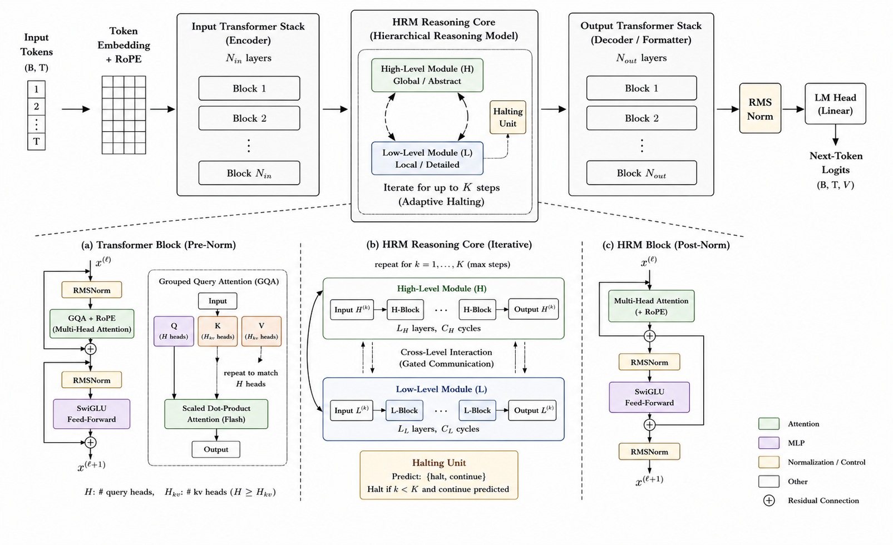
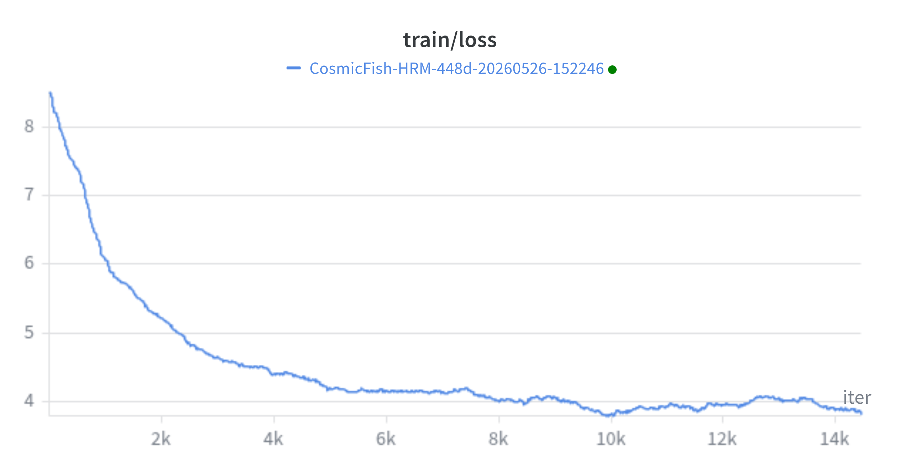
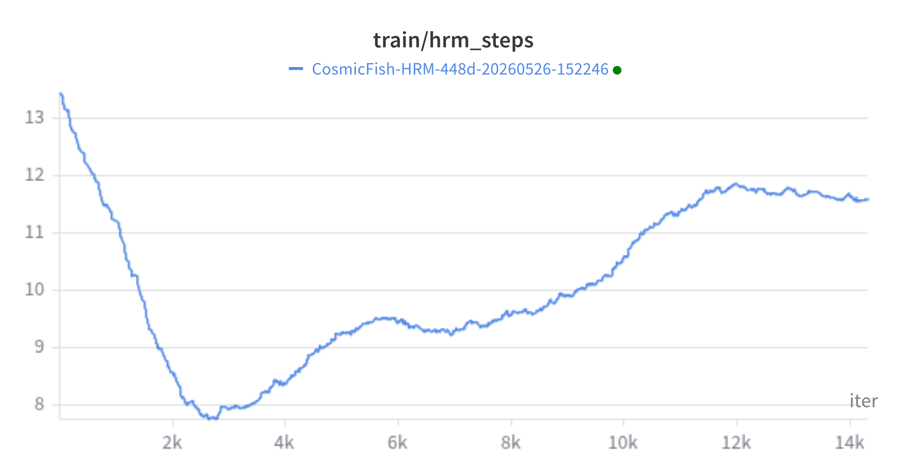

# CosmicFish-HRM

**Paper:** [CosmicFish-HRM: Adaptive Reasoning via Hierarchical Recurrent Mechanisms in Compact Language Models](https://arxiv.org/abs/2605.28919)

A language model with a Hierarchical Recurrent Module (HRM) that learns to allocate compute dynamically at inference time. Built at Mistyoz AI.

## Architecture



CosmicFish-HRM extends the CosmicFish architecture with an adaptive reasoning core between the input and output transformer stacks. Rather than using a fixed number of forward-pass layers, the HRM iteratively refines hidden states across H-level and L-level reasoning layers until a learned halting policy decides to stop. This allows the model to spend more compute on harder tokens and less on trivial ones.

```
Input Blocks (Transformer) → HRM Core (H + L levels, variable steps) → Output Blocks (Transformer) → LM Head
```

**Key components:**

- Grouped-Query Attention (GQA) with 8 heads, 4 KV heads
- Rotary Position Embeddings (RoPE)
- SwiGLU activation
- RMSNorm (pre-norm for I/O blocks, post-norm inside HRM)
- Learned halt/continue Q-head that controls reasoning depth per token
- Step penalty in the training loss to encourage efficient halting

## Model Specs

| Parameter | Value |
|-----------|-------|
| Vocabulary | 50,304 |
| Embedding dim | 448 |
| Context length | 512 |
| Input layers | 6 |
| Output layers | 6 |
| HRM H-layers | 4 |
| HRM L-layers | 4 |
| Max HRM steps | 16 |
| Attention heads | 8 (4 KV) |

## Training





The model is trained on approximately 10B tokens drawn from:

- FineWeb (3B), Wikipedia (3B), OpenWebText (1B), C4 (1B) -- core web and text
- CodeParrot (1B), OpenWebMath (500M), ArXiv (500M) -- technical and reasoning

Training uses cosine learning rate decay with linear warmup, bfloat16 mixed precision, gradient clipping, and optional distributed training via DDP. W&B logging is included.

## Training Pipeline

```
prepare.py → train.py → convd.py → finetune.py → identity.py → calib.py
```

### 1. Prepare data

```bash
python prepare.py
```

Downloads and tokenizes all datasets into per-dataset `train.bin` / `val.bin` files.

### 2. Pre-train

```bash
python train.py \
    --data_dir data \
    --batch_size 64 \
    --gradient_accumulation_steps 2 \
    --max_iters 200000 \
    --wandb_log
```

### 3. Conversational fine-tuning

```bash
python convd.py
```

### 4. Instruction fine-tuning

```bash
python finetune.py \
    --pretrained_model out/best_model.pt \
    --data_dir data/alpaca_gpt4_cleaned_pure \
    --out_dir out_finetune
```

### 5. Identity calibration

```bash
python identity.py
python calib.py --model_path out_finetune/best_model.pt
```

Identity calibration mixes identity data (40%) with conversational data (60%) at a very low learning rate (5e-7) to stabilize model persona without degrading task performance. Early stopping is triggered if conversational loss increases by more than 0.15.

## Inference

```bash
python chat.py \
    --model_path out/calibrated/best_calibrated.pt
```

**Options:**

| Flag | Default | Description |
|------|---------|-------------|
| `--temperature` | 0.5 | Sampling temperature |
| `--max_tokens` | 200 | Max tokens to generate |
| `--top_k` | 40 | Top-k sampling |
| `--top_p` | 0.9 | Nucleus sampling threshold |
| `--force_hrm_steps` | None | Override max HRM steps at inference |
| `--show_hrm_steps` | False | Print per-token HRM step counts |

In interactive mode, runtime commands include `/temp`, `/tokens`, `/hrm`, `/topk`, `/topp`, and `/debug`.

## Project Structure

```
├── model.py        -- Architecture
├── train.py        -- Pre-training loop
├── prepare.py      -- Dataset download and tokenization
├── convd.py        -- Conversational fine-tuning dataset
├── finetune.py     -- Instruction fine-tuning
├── identity.py     -- Identity data preparation
├── calib.py        -- Identity calibration
├── chat.py         -- Inference script
├── test.py         -- Inference for base model
├── hrm_eval.py     -- Evaluation script
└── CF.ipynb        -- Training notebook
```

## Requirements

```
torch>=2.0
tiktoken
numpy
datasets
transformers
wandb
tqdm
termcolor
matplotlib
```
---

Mistyoz AI, Hyderabad
